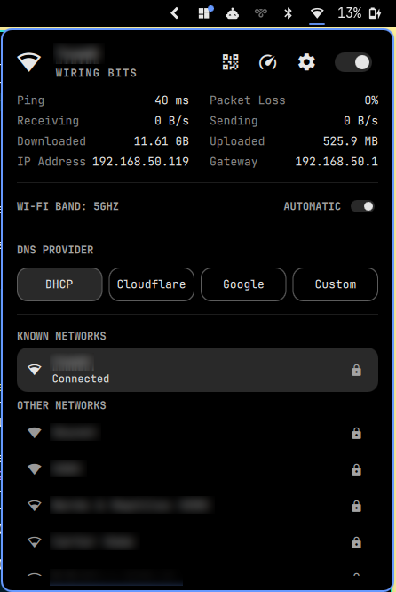

# Network Plus

Omarchy's Network bar panel, plus a gear button that opens the network settings
app of your choice.



Network Plus is a drop-in replacement for Omarchy's built-in Network bar widget.
Everything in the built-in panel works as before. The only addition is a
settings button in the panel header that opens a full network manager such as
nm-connection-editor, for things the panel doesn't cover: VPNs, static IPs,
proxies, Ethernet profiles, and so on.

## Features

- **Everything from the built-in panel**: Wi-Fi list, connect, disconnect and
  forget networks, connection stats, Wi-Fi band and DNS provider, the QR code
  and speed test buttons, the Wi-Fi switch, and the same keyboard navigation
- **Settings button**: a gear next to the Wi-Fi switch opens your network
  settings app and closes the panel. It's part of the header's keyboard cursor
  too, so you can reach it with the arrow keys.
- **Configurable app**: defaults to `nm-connection-editor`. Any command works,
  including flags. Leave it empty to hide the gear.
- **Drop-in replacement** for the built-in `omarchy.network` plugin. Omarchy's
  `Super + Ctrl + W` keybind keeps working unchanged.

## Prerequisites

- Omarchy 4 (Quattro), with NetworkManager (the panel itself needs it, as the
  built-in one does)
- A network settings app for the gear to open. The default is
  **nm-connection-editor**, which isn't installed with Omarchy by default:

  ```bash
  omarchy pkg add nm-connection-editor
  ```

  If you'd rather use another app, see [Configuration](#configuration). The rest
  of the panel works without one.

## Install

```bash
omarchy plugin add https://github.com/mrjohnnycake/omarchy-network-plus.git --enable
```

Enabling Network Plus puts it in the built-in Network widget's place in the bar.
Your bar layout is otherwise left alone.

If you install without `--enable`, enable it later with:

```bash
omarchy plugin enable mrjohnnycake.network-plus
```

## Usage

| Action | Result |
|---|---|
| Click the bar icon | Open or close the panel |
| Gear button in the panel | Open your network settings app |
| `s` with the panel open | Open your network settings app |
| `w` with the panel open | Turn Wi-Fi on or off |
| `r` with the panel open | Refresh |
| `Super + Ctrl + W` | Open or close the panel (Omarchy default) |

To open the settings app from your own keybind or script:

```bash
omarchy-shell omarchy.network openSettings
```

## Configuration

The gear runs the `settingsCommand` setting, which defaults to
`nm-connection-editor`. Change it with:

```bash
omarchy bar set mrjohnnycake.network-plus settingsCommand "omarchy-launch-or-focus-tui nmtui"
```

or add it to the plugin's entry in `~/.config/omarchy/shell.json`:

```json
{ "id": "mrjohnnycake.network-plus", "settingsCommand": "omarchy-launch-or-focus-tui nmtui" }
```

Changes apply right away, with no restart. The command runs through `bash`, so it
can carry flags or environment variables.

### Common network managers

The panel works with NetworkManager, so these are all NetworkManager front-ends.
Install the app, then point `settingsCommand` at it. Terminal apps are launched
with `omarchy-launch-or-focus-tui`, which opens them in your terminal, or focuses
the window if it's already open.

**nm-connection-editor** (default, GTK)

```bash
omarchy pkg add nm-connection-editor
omarchy bar set mrjohnnycake.network-plus settingsCommand nm-connection-editor
```

**nmtui** (terminal, comes with NetworkManager)

```bash
omarchy bar set mrjohnnycake.network-plus settingsCommand "omarchy-launch-or-focus-tui nmtui"
```

**KDE Plasma network settings**

```bash
omarchy pkg add systemsettings plasma-nm
omarchy bar set mrjohnnycake.network-plus settingsCommand "systemsettings kcm_networkmanagement"
```

**GNOME Settings Wi-Fi page.** GNOME Settings refuses to start outside GNOME
unless it's told it's running there, so the command sets `XDG_CURRENT_DESKTOP`.
Use `network` instead of `wifi` for the wired and VPN page:

```bash
omarchy pkg add gnome-control-center
omarchy bar set mrjohnnycake.network-plus settingsCommand "XDG_CURRENT_DESKTOP=GNOME gnome-control-center wifi"
```

**Hide the gear**

```bash
omarchy bar set mrjohnnycake.network-plus settingsCommand ""
```

In `shell.json`, the same settings look like this:

| App | `settingsCommand` |
|---|---|
| nm-connection-editor | `nm-connection-editor` |
| nmtui | `omarchy-launch-or-focus-tui nmtui` |
| KDE Plasma | `systemsettings kcm_networkmanagement` |
| GNOME Settings | `XDG_CURRENT_DESKTOP=GNOME gnome-control-center wifi` |
| Hide the gear | `""` |

## Remove

```bash
omarchy plugin remove mrjohnnycake.network-plus
```

Removing the plugin restores Omarchy's built-in Network widget.

## License

MIT. See [LICENSE](LICENSE). This plugin is derived from Omarchy's built-in
Network plugin (`omarchy.network`), © David Heinemeier Hansson, also MIT.
